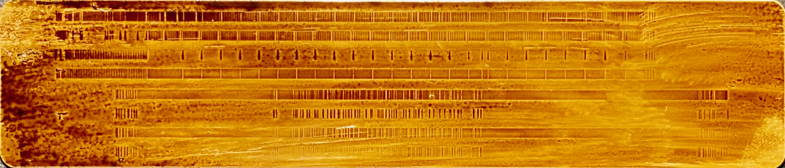

# Card Recovery

*Status: idea / feasibility analysis, not implemented. Goal: build a
Raspberry Pi Pico–based capture rig that listens in parallel, non-invasively,
to an intact, working TI-59's own card reads — via 4 (or optionally 6) wires
soldered to the existing main board — and decodes the raw waveform with
modern methods to recover cards the calculator's own fixed-threshold 1970s
electronics fail to read cleanly. There is no donor/spare unit for this
project: the only TI-59 involved is the working one, so the tap has to be
planned and verified before any soldering happens.*

Source for the hardware facts below: *TI Programmable 58/59 Service Manual*
(local copy: `~/SynologyDrive/Dokumente/PDF/Vintage/TI/manuals/TI 59-service-manual.pdf`),
and `rom/TI59-commented.asm` in this repository (the actual disassembled,
trace-verified TI-59 ROM). See also [`ideas/Pico.md`](Pico.md) for the
broader Pico-interfacing context this grew out of.

---

## 1. The documented signal chain

**Analog front end (manual p.11-14, Fig.5).** Each of the 4 tracks has its
own `LM324` op-amp channel: ~500× gain (825KΩ feedback resistor), AC-coupled
to the head through a 1210Ω/33µF series network shared with the tri-state
write driver on the same node. Head output is tiny — 3-4mV peak, alternating
polarity, one pulse per flux transition (inherent to any inductive read
head: output ∝ dΦ/dt). The manual states explicitly that "the frequency of
the pulses/square wave varies depending upon the particular program" (p.11)
— a self-clocking scheme where transition *spacing*, not polarity or count,
carries the data.

**Digitization (`TMC0594`, Fig.5).** The amplified signal (LM324 output pins
1, 7, 8, 14 — labeled `READ1`–`READ4`) feeds directly into the `TMC0594`
magnetic-I/O chip, which "conditions the signals... to make them compatible
with MOS logic levels" (p.7). No separate comparator IC appears in the
schematic, so pulse-slicing happens inside that chip.

## 2. What the ROM disassembly reveals — and what it doesn't

`rom/TI59-commented.asm`, card-read routine around `0x16BB`–`0x17F1`, shows
a clean repeating pattern, e.g. at `0x16CC`–`0x16DB`:

```
16CC: CRD.RD
16CD: CRD.IN            ; IN CRD — pulls one already-formed nibble off EXT
16CE: MOV KR,EXT[4..15]
16D0: MOV R5,KR[4..7]   ; extract the 4-bit nibble
16D2: A=A+D DPT         ; decimal-add it into an accumulator (1-digit field)
...
16D4: CRD.IN            ; next nibble
...
16DA: A=A+B DPT         ; accumulate again
16DB: JNC 16DC
16DC: A=A-1 EXP1        ; decrement a byte/nibble counter
16DD: JC 16D3           ; loop
```

Two conclusions follow:

1. **The ROM never sees a raw pulse or a timing measurement.** Every
   `IN CRD` returns a complete, already-decoded 4-bit BCD nibble over the
   `EXT` bus. All flux-transition timing recovery happens **inside the
   TMC0594 silicon**, invisible to software and therefore invisible to us
   via disassembly. It's a black box.
2. **The checksum is a simple decimal digit-sum** — nibbles are decimally
   added into an accumulator (`A=A+D DPT` / `A=A+B DPT`, using the ALU's
   1-digit `DPT` field width purely as a "1 nibble wide" selector) as they
   stream in. Around `0x17AA`, a mismatch sets `fB[4]`, which feeds the
   error/printer path from `0x17C1`. There's no visible redundancy or
   error-correcting structure — one bad nibble anywhere in a bank fails the
   whole bank's checksum, with zero recovery margin built into the format.
   This matches the symptom (partial reads, all-or-nothing checksum
   failure) exactly.

## 3. What the ferrofluid image adds



*The card imaged above is [`examples/diag.ti59`](../examples/diag.ti59)
loaded into a real TI-59, developed with ferrofluid to make the recorded
flux pattern visible.*

### Two banks, two physical passes, eight real tracks

A TI-59 card holds one or two 240-step banks. Per the `CUECARD` block in
`examples/diag.ti59` (`Banks: 1,2`), the diagnostic card uses both: bank 1
is `PROGRAM` steps 000-239 (the actual diagnostic routine), bank 2 is steps
240-479 — which, per the same file, is **every single step set to nibble
`77`** (opcode `GE`), 240 times over. The two banks are written (and read)
as two separate physical passes: the card is inserted once for bank 1, then
flipped 180° (both end-to-end and top-to-bottom) and re-inserted for bank
2. The 4-track head only ever accesses 4 tracks per pass, occupying one
half of the card's width; flipping the card presents its *other* half-width
to the same 4 heads for the second pass. The image confirms this directly:
**there are 8 real, physical tracks visible — 4 per bank, mirrored across
the card** — not 4 tracks with a ferrofluid-doubling artifact, as an earlier
draft of this document guessed. This is a real, useful structural fact:
each bank genuinely only uses 4 parallel tracks, matching the schematic
(Fig.5: `TRACK1`–`TRACK4`).

This also explains the picture's dense/sparse contrast cleanly:

- **The dense, uniform, tightly-ticked region (top half of the image) is
  bank 2** — 240 identical `77` nibbles in a row. Every nibble is the same
  nonzero value, so (per the finding below) every bit-cell produces a
  transition, giving the regular comb pattern visible in the photo.
- **The sparser, irregular region (bottom half) is bank 1** — the actual
  diagnostic program. `examples/diag.ti59`'s own comment on the `PROGRAM`
  block ("The programs contains many zeroes, which are skipped below")
  confirms most of bank 1's steps are `00`. The irregular gaps in that half
  of the image are real program content interspersed with long stretches
  of near-silence — not sync fields, not noise, just zero-valued data.

### Byte-encoding hypothesis: 4 tracks × 2 card-length positions = 8 bits

Since the 4 tracks are read/written in parallel across the card's width,
the natural way to record an 8-bit value (each program step's opcode byte,
e.g. `77`) is as 2 sequential positions along the card's length, each
contributing 4 bits (one per track) — giving exactly 8 bits per step, e.g.
`77` as `01110111`. This is a sound physical model, but **it can't be
confirmed by eye from the photo** — counting tick marks doesn't
unambiguously reconstruct bit values without knowing the exact per-bit
encoding rule, and that requires real captured, calibrated data from the
Pico rather than visual inspection. Actually reading the card is the only
way to settle this.

One thing worth reasoning through now, though, because it sharpens what to
look for once real data exists: it argues *against* a simple
change-on-value (NRZ-L) per-track encoding, and *for* the "pulse-per-1-bit"
hypothesis below. Under NRZ-L, a track only transitions when its bit value
*changes* from the previous cycle — so 240 repetitions of the *same* byte
(`77`, bank 2) would produce almost no transitions (nothing changes cycle
to cycle), while bank 1's varying program data would produce comparatively
more. That's the opposite of what the image shows: bank 2 (constant,
repeated `77`) is the dense region, bank 1 (varying, mostly-zero) is the
sparse one. That's consistent instead with each bit cell being marked
independently of the previous one — a transition (or pulse) written
whenever a bit is `1`, nothing written when it's `0` — which is also
exactly what's needed to explain the next finding.

### The critical finding: `00` nibbles produce no flux transitions at all

This is the single most important empirical fact for the whole project, and
it rules out the F2F/Aiken-biphase hypothesis from the first draft of this
document outright. Biphase/F2F-style self-clocking schemes exist
specifically to *guarantee* a transition at every bit-cell boundary
regardless of data value — that's the entire point of the "phase" in
biphase. If a `0000` nibble genuinely produces zero transitions (not just
fewer), the TI-59's format cannot be true biphase/F2F. It's closer to a
simple two-level scheme where a "1" bit writes a pulse and a "0" bit writes
nothing (unipolar RZ) or an NRZI-style "transition = 1, no transition = 0"
mapping, applied per bit — either way, a `0000` nibble (4 zero bits) is
consistent with producing a true silent gap, and this matches bank 1's
sparse regions in the photo, which correspond to exactly the zero-heavy
program content described in the source file.

**This makes clock recovery materially harder than an ordinary
self-clocking-format problem**, and changes the software design in §5.6:
a pure PLL that only adapts by tracking observed transitions has nothing to
track during a run of zero nibbles — it can only coast on its last known
rate estimate and hope the motor speed (already known to wobble audibly)
hasn't drifted much during the gap. The real design constraint isn't "track
the data rate," it's "survive multi-bit-cell silence without losing the
clock," which is a different and harder problem.

### Header region, and azimuth

- The heavily stained, blotchy dark region at the start of each bank's
  tracks is most likely the **card header** — a structurally distinct
  preamble/metadata region at the start of a bank, separate from the pure
  program-step data, that would naturally look different from the uniform
  `77` fill under ferrofluid simply because its bit content differs. This
  is a better-grounded explanation than "physical damage," though the
  header region — being scanned on every single read attempt, including
  failed/partial ones — could plausibly also show more accumulated wear on
  top of that; the two aren't mutually exclusive.
- **Worth checking specifically for the azimuth question:** pick a moment
  in time during writing (a vertical line at some horizontal position on
  the card) and check whether the flux transitions across all 4 tracks of
  a given bank line up in a straight vertical line, or are diagonally
  offset from track to track. A consistent diagonal offset is the direct
  visual signature of a head that was tilted (non-zero azimuth) relative
  to the track direction at write time — worth a careful pixel-level
  cross-track alignment check on a high-resolution version of the image,
  which a casual visual read can't fully confirm.
- Because bank 1 and bank 2 are written/read in two physically reversed
  passes (above), an azimuth mismatch would show up *differently* on the
  two halves of the same card — worth comparing tick sharpness/amplitude
  between the top and bottom halves of the image as a cheap first check,
  before doing the more rigorous cross-track alignment measurement.

Three independent, additive problems are therefore in play: **azimuth
mismatch** between the head that originally wrote most of your cards and
your current unit's head (it wasn't the machine most of these cards were
written on), **motor speed variance** (audible, per your report) during
reads, and a **recording format with true silent gaps** that removes the
usual self-clocking safety net during exactly the periods where speed
variance matters most. All three point at the same fix: don't rely on the
recorded signal alone for timing (§5.6, "flywheel" clock).

## 4. Design implication: a parallel, non-invasive tap on your intact TI-59

There's no donor unit for this project — the plan is to tap 4 (or
optionally 6) signals directly off your only working TI-59's main board
while it performs a completely normal card read, and have the Pico capture
and independently decode the same raw signal in parallel. The TI-59's own
motor, transport, and power supply do all the mechanical and electrical
work exactly as they always have; nothing about the calculator's own read
attempt is disturbed except by the tap itself. Given that, the whole design
should be judged first on how little it disturbs the original circuit, and
only second on decode quality — you can iterate on decode software
indefinitely once you have clean captured data, but a bad tap can degrade
or damage the one TI-59 you have.

Two concrete risks that shape the circuit design in §5:

1. **Loading.** Any wire soldered onto the `READ1`–`READ4` nodes (LM324
   output, U10) adds capacitance and draws some current from that node. A
   healthy op-amp output shrugs this off if the added load is high
   impedance, but a low-impedance or poorly-designed tap could measurably
   change the very signal you're trying to observe — worst case, making
   the TI-59's *own* reads worse than before the tap existed. The
   conditioning circuit in §5.3 is designed around a high-impedance,
   AC-coupled first stage specifically to avoid this.
2. **Voltage domain.** `READ1`–`READ4` swing in the TI-59's negative MOS
   domain (roughly 0 to −10V relative to system ground `Vss`, per §1 /
   manual p.3), while the Pico's ADC/GPIO pins are only rated for
   0–3.3V. Connecting a tap wire straight to a Pico pin without protection
   risks destroying it instantly on power-up or a wiring mistake — with no
   spare unit, that failure mode is worth designing out entirely rather
   than working around after the fact (§5.3 covers the AC-coupling +
   clamp-diode approach).

Write capability is intentionally out of scope — this is a listen-only tap,
so nothing about the `TMC0594`'s write path is touched.

---

## 5. Circuit design

### 5.1 Block diagram

```
   TI-59 main board                    ┌───────────────────────────────┐
   (unmodified, reading a card         │  Per-channel signal            │
   exactly as normal) ─── 4 solder ────┤  conditioning (×4, breadboard) │
   points: LM324 (U10) pins            │  AC-couple → bias → clamp →     │
   1, 7, 8, 14 ("READ1"-"READ4")       │  gain → anti-alias filter       │
                                        └──────────────┬──────────────┘
   optional: 2 more tap points                          │ 4 analog channels,
   at the card-sense/position                           │ 0-3.3V, biased ~1.65V
   switches (Fig.6) ── digital,                          ▼
   already 0/Vdd-swinging ──┐          ┌───────────────────────────────┐
                              │         │  External 4/8-ch 12-bit ADC     │
                              ├────────▶│  (SPI), e.g. MCP3208             │
                              │         └──────────────┬──────────────┘
                     (through the same                  │ SPI
                      clamp/level-shift                  ▼
                      protection as the           ┌───────────────────────┐
                      analog channels)             │ Raspberry Pi Pico/Pico 2 │
                                                    │ - captures all channels  │
                                                    │ - flywheel clock recovery│
                                                    │ - adaptive thresholding  │
                                                    │ - checksum-guided repair │
                                                    │ - optional record-window │
                                                    │   trigger from card-sense│
                                                    └──────────────┬────────┘
                                                                    │ USB CDC
                                                                    ▼
                                                              Host PC
```

The TI-59's own motor, power supply, and logic are completely untouched —
this diagram only adds a passive tap and the Pico-side capture chain.

### 5.2 Identifying and making the tap points

This is the step to get right before any soldering, given there's no
spare board to practice mistakes on.

- **Primary taps — `READ1`–`READ4`:** LM324 (`U10`) pins **1, 7, 8, 14**
  per the schematic (Fig.5) — the amplified, post-preamp, pre-`TMC0594`
  signal for each track. If soldering directly to a 40-year-old DIP IC pin
  feels too risky (fine pitch, risk of bridging adjacent pins, risk of
  lifting a pad on old FR4), an electrically identical alternative is the
  nearby passive component legs on the same net: the 1210Ω resistors
  `R11`/`R13`/`R10`/`R8` sit directly between each op-amp output and the
  head (Fig.5) and are a lower-density, more solder-friendly target for a
  tack-soldered wire.
- **Optional taps — card-sense/position switches:** per Fig.6, the card
  sense switch sits between node `D10` (via diode `CR6`, TI-59 only) and
  the `KR` node (into `U1` pin 10); the card position switch sits between
  `C.S.I.` (from `U9` pin 10) and `-Vdd`. Both are simple mechanical
  normally-closed switches — the easiest, least invasive tap is directly
  across the physical switch terminals near the card slot, rather than at
  the IC pins.
- **Board revision caveat:** the manual documents at least 7 different
  board "dash number" revisions with component differences (p.23-24,
  "Modifications" — e.g. `-1`/`-2` boards needing full PCB replacement for
  some faults, `-3` through `-6` needing added components). The manual's
  physical board-layout diagrams (referenced on p.47-49 as "Dash 1,2,3
  boards" / "Dash 4,5,6 boards" / "Dash 7 boards") would show exactly where
  `U9`/`U10` and the associated passives sit on each revision, but this
  session wasn't able to reliably extract those specific pages from the
  PDF (repeated attempts returned earlier pages instead — worth trying
  again directly, or opening the PDF manually). Identify your board's dash
  number and locate `U9`/`U10` by their silkscreen designators before
  relying on any pin-numbering assumption from the schematic alone, and
  verify every intended tap point with a multimeter in continuity/diode
  mode against the schematic's documented signal names before soldering
  anything.
- **Mechanical practice:** use the thinnest wire that's practical (e.g.
  30 AWG wire-wrap wire), tack-solder rather than trying to route a
  permanent PCB modification, and consider a small dab of hot glue or
  RTV over each joint for strain relief once verified working — the goal
  is a tap that can be removed cleanly later if needed, not a permanent
  rework.

### 5.3 Per-channel signal conditioning

The key design choice, given §4's risks: **AC-couple right at the tap
point, before anything else.** This does two things at once — it removes
the negative DC bias immediately (so nothing downstream needs to tolerate
or generate negative voltages), and it presents a very high impedance to
the LM324 output at DC (a coupling capacitor draws no steady current),
minimizing loading on the original circuit.

```
 Tap point (READ1..4, swinging ~0 to -10V with AC pulses riding on it)
   │
   ├── C1 (1-10 µF, non-polarized/film) ── blocks the DC bias entirely;
   │                                        only the small AC pulse content
   │                                        passes through
   │
   ├── R1 (≈1 MΩ) to GND, R2 (≈1 MΩ) to +3.3V ── soft bias network,
   │     high impedance (negligible additional loading on the tap),
   │     centers the AC signal around ~1.65V referenced to shared ground
   │
   ├── clamp diodes (e.g. BAT54 or 1N4148) from this node to GND and to
   │     +3.3V ── protects everything downstream against an unexpectedly
   │     large excursion or a wiring mistake, since this node is now
   │     "just" a small 0-3.3V-ish signal, not the calculator's own
   │     negative rail
   │
   ▼
 single-supply op-amp gain stage (non-inverting, gain ≈ 5-20×, tunable)
   │        — LM324/TL074/MCP6004, powered from 3.3V or 5V referenced to
   │           the SAME ground as the TI-59's Vss (share ground only —
   │           do not borrow the TI-59's own Vdd/Vgg/battery supply for
   │           this circuit)
   ▼
 anti-alias RC filter (a few kΩ + a few nF, cutoff a few 10s of kHz —
   card speed is only ~2.3 IPS so this is a low-frequency signal; refine
   once real capture data exists)
   ▼
 to ADC channel N
```

- **Gain is now much more modest than a from-scratch preamp would need**
  (5-20× rather than 500-1000×), because the TI-59's own `LM324` has
  already done the bulk of the amplification — this tap only needs to
  bring an already-substantial signal (up to ~1-2V p-p per the manual's
  numbers) into the ADC's usable range, plus a bit of headroom for
  marginal/weak cards.
- One quad op-amp package covers all 4 (or up to 4 of 6, if also
  conditioning the digital card-sense taps through the same clamp
  network) channels.
- The optional card-sense/position taps can go through an identical
  clamp+bias front end even though they're simpler digital signals — same
  protection logic applies, since they're also referenced to the
  calculator's negative-domain logic levels, not 0-3.3V.

### 5.4 ADC

The Pico's own onboard ADC only exposes 3 external channels (`GPIO26-28`)
and they share a single physical SAR converter anyway — no true
simultaneous sampling either way. Cleaner to use an external SPI ADC:

- **`MCP3208`** (8-channel, 12-bit, SPI) — cheap, breadboard-friendly,
  well-documented, leaves channels spare for the optional card-sense taps
  and a possible speed sensor (below). `MCP3204` (4-channel) is the
  minimal equivalent if only the 4 read channels are wired up.
- Wire `SCK`/`MOSI`/`MISO`/`CS` to any 4 Pico GPIOs, `Vref`/`Vdd` to the
  Pico's 3.3V rail so ADC codes map directly to 0-3.3V.
- Round-robin all channels every capture cycle. Given card speed is slow
  and the signal bandwidth is low, the achievable channel rate from even a
  modest SPI clock is enormous overkill relative to what's needed — no
  risk of missing transitions from multiplexing overhead.

### 5.5 Optional: card-sense trigger and speed sensing

- **Card-sense/position as a recording trigger.** Tapped per §5.2 and
  conditioned per §5.3, these let the Pico start/stop its own waveform
  capture automatically around when a card is actually present and
  moving, rather than free-running continuously. Purely a convenience —
  the Pico could just as well sample continuously and let the host-side
  software find the interesting region by signal presence, which is
  simpler to wire (2 fewer tap points) at the cost of more data to sift
  through per session. Given the goal here is decode quality, not wiring
  minimalism, wiring the trigger is worth it if the extra 2 tap points are
  acceptable.
- **Optional speed sensor.** A simple photo-interrupter or magnetic
  tachometer, physically mounted to observe the existing drive
  roller/pinch roller shaft (no electrical connection into the TI-59's own
  circuit at all — purely an added external sensor), feeding a spare ADC
  channel or GPIO interrupt. This gives the Pico a direct, independent
  measurement of instantaneous card speed — useful both as a diagnostic
  (quantifies the audible speed wobble directly) and as an input to the
  flywheel clock recovery in §5.6, rather than inferring speed purely from
  the transition pattern itself.

### 5.6 Software: what "modern methods" concretely means here

- **Flywheel clock recovery, not a plain PLL.** A standard data-separator
  PLL that only adjusts on observed transitions is not sufficient here —
  §3 confirms `00` nibbles produce genuine multi-bit-cell silence (this
  isn't F2F/biphase, which would guarantee a transition every cell), so
  there are real stretches with nothing to lock onto. The clock needs to
  **coast through silent gaps** on its last-known rate estimate (ideally
  informed by the optional speed sensor in §5.5, since motor speed is the
  only independent timing reference available during a gap) and reacquire
  precisely the instant transitions resume. This is a well-known technique
  in weak/non-self-clocking tape and magcard formats — a "flywheel" or
  "coasting" data separator — but it needs to be designed in from the
  start rather than bolted onto a naive PLL, since coasting accuracy over
  a *known maximum* silent-gap length (worst case: the longest run of `00`
  nibbles expected in real program data) is the actual design target, not
  just average-case tracking.
- **Adaptive, per-track amplitude thresholding** instead of a fixed
  hardware comparator level — likely the single biggest win against a
  weakened/uneven signal from head wear, tape wear, or the azimuth
  mismatch, all of which reduce peak amplitude and blur transition edges
  rather than eliminating them outright.
- **Azimuth correction is partly mechanical, not purely a software
  problem.** If the cross-track skew check in §3 confirms an azimuth
  mismatch, the most effective fix is adjusting the physical head angle
  (an azimuth screw, if the mechanism has one, or a shim) while watching
  live captured waveform amplitude/edge sharpness on the host PC — the
  same "align by ear/scope" procedure used in tape-deck restoration.
  Software can compensate for some residual smear, but a genuinely
  misaligned head reduces the fundamental information content of what's
  captured; no amount of downstream processing recovers information that
  never made it into the amplified signal.
- **Multi-pass, checksum-guided reconstruction.** Because the TI-59's
  checksum (§2) is only a single decimal digit-sum with no built-in
  redundancy, a bad nibble anywhere fails the whole bank on real hardware
  with no way to know *which* nibble was wrong. With raw waveforms
  captured on the Pico, this weakness becomes exploitable: read the same
  card several passes, flag nibbles with low-confidence analog features
  (marginal amplitude, ambiguous timing) rather than accepting the
  hardware's binary decision, and try local corrections against the
  checksum across the small set of marginal nibbles. This can recover
  banks that would fail outright on stock hardware, at the cost of being
  probabilistic rather than certain — worth flagging when a reconstructed
  bank relied on checksum-guided correction rather than a clean,
  unambiguous read.
- **Log raw waveforms, not just decoded bits**, at least during
  development. Until the actual bit-level encoding is empirically
  confirmed (§3), having full raw capture from a card with known content is
  what makes reverse-engineering the encoding tractable. `examples/diag.ti59`
  is a ready-made calibration reference for exactly this: its bank 2 is 240
  identical known-nonzero nibbles (characterizes the dense, guaranteed-
  transition case) and its bank 1 is real program data with documented
  zero-heavy content (characterizes the silent-gap case from §3) — both
  halves of the encoding's behavior, in one physical card, with the exact
  expected bit content already known from the source file.

### 5.7 Rough bill of materials

| Part | Qty | Notes |
|---|---|---|
| Raspberry Pi Pico / Pico 2 | 1 | brain + USB link to host |
| Quad op-amp (`LM324`/`TL074`/`MCP6004`) | 1 | new part; conditions all 4 read channels |
| `MCP3208` (or `MCP3204`) SPI ADC | 1 | true multi-channel capture |
| Small-signal clamp diodes (e.g. `BAT54`/`1N4148`) | ~12-16 | 2 per channel, both analog and optional digital taps |
| Resistors/capacitors for bias, gain, anti-alias | ~20-30 | values per §5.3, tune empirically |
| 30 AWG wire-wrap wire | a few feet | for the tap points themselves |
| Breadboard + jumper wires | — | |
| Optional: photo-interrupter/tachometer | 1 | speed diagnostics + flywheel-clock input |

No motor, motor driver, or transport hardware — the TI-59's own is used
untouched.

---

## Suggested order of attack

1. Identify your board's dash-number revision and locate `U9`/`U10` and
   the card-sense switches by their silkscreen designators (§5.2), then
   verify every intended tap point with a multimeter against the schematic
   before touching a soldering iron.
2. Build the signal-conditioning circuit (§5.3) on the bench first, driven
   by a bench signal generator or a simple RC-decayed pulse source
   standing in for the expected AC signal — confirm the AC-coupling,
   clamp, and gain stages behave as expected *before* connecting anything
   to the live TI-59.
3. Do the actual taps — minimal, reversible, verified one at a time — and
   confirm the TI-59 still reads cards exactly as well as before the tap
   (a regression here means the tap is loading the circuit and the
   conditioning design needs revisiting).
4. Capture raw waveforms from `examples/diag.ti59`'s physical card first —
   its known content (§5.6) makes it the ideal first calibration target —
   then from a range of your other cards spanning "reads fine" to "fails
   checksum."
5. Do the azimuth cross-track alignment check (§3) on captured data (not
   just the photo) and, if confirmed, do a physical azimuth adjustment
   pass using live waveform quality as feedback.
6. Only then invest in the full software decode pipeline (§5.6) — there's
   limited point tuning flywheel clock recovery and adaptive thresholds
   against a transport that still has a known, fixable mechanical problem.
